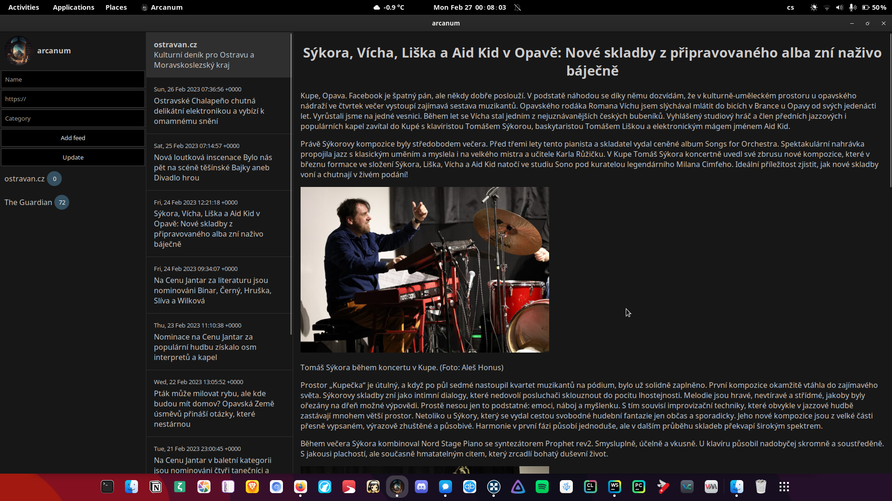

# Arcanum RSS

This is a simple RSS reader that I made to learn Rust and Tauri. I wanted something quite simple to use daily to read my feeds.
It is relatively quick, looks nice and is definitely not finished. It only works online because it doesn't cache images.

## Svelte + Tauri + Vite
This template should help get you started developing with Tauri and Svelte in Vite.

## Recommended IDE Setup

[VS Code](https://code.visualstudio.com/) + [Svelte](https://marketplace.visualstudio.com/items?itemName=svelte.svelte-vscode) + [Tauri](https://marketplace.visualstudio.com/items?itemName=tauri-apps.tauri-vscode) + [ryust-analyzer](https://marketplace.visualstudio.com/items?itemName=rust-lang.rust-analyzer).

