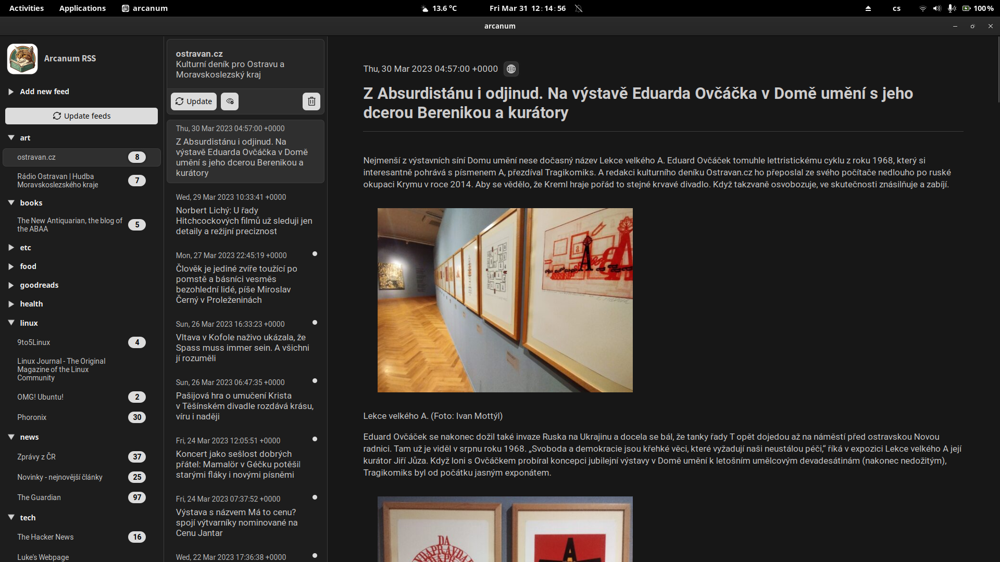

# Arcanum RSS

This is a simple RSS reader written in Rust. 
The main purpose of this project was to have a simple tool to read my feeds every day.
The reader doesn't cache images or other media, only the text, which I find sufficient for offline reading.
Vim keybindings included.

## How to use
You can download a prebuilt binary from the [releases](https://github.com/dhonus/arcanum/releases) page. Only linux tested. 

You can build arcanum yourself by completing [setting up](https://tauri.app/v1/guides/getting-started/prerequisites#setting-up-linux) and running `npm install` and `npm run tauri build` in the root of the project.

### Key bindings
|key|action|
|---|---|
|h|move to column on the left|
|l|move to column on the right|
|j|move cursor down|
|k|move cursor up|
|g|scroll to the top of the current column|
|G|scroll to the bottom of the current column|

## Svelte + Tauri + Vite
This template should help get you started developing with Tauri and Svelte in Vite.

## Recommended IDE Setup

[VS Code](https://code.visualstudio.com/) + [Svelte](https://marketplace.visualstudio.com/items?itemName=svelte.svelte-vscode) + [Tauri](https://marketplace.visualstudio.com/items?itemName=tauri-apps.tauri-vscode) + [ryust-analyzer](https://marketplace.visualstudio.com/items?itemName=rust-lang.rust-analyzer).
